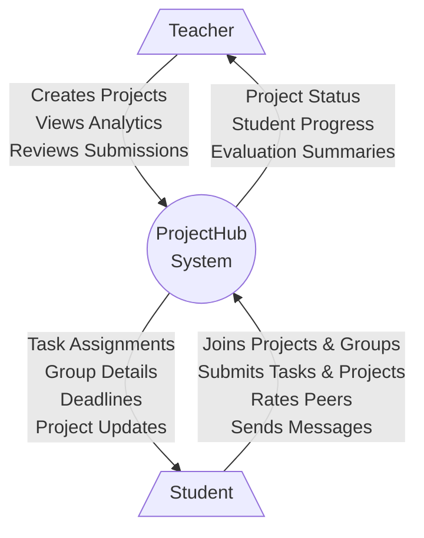
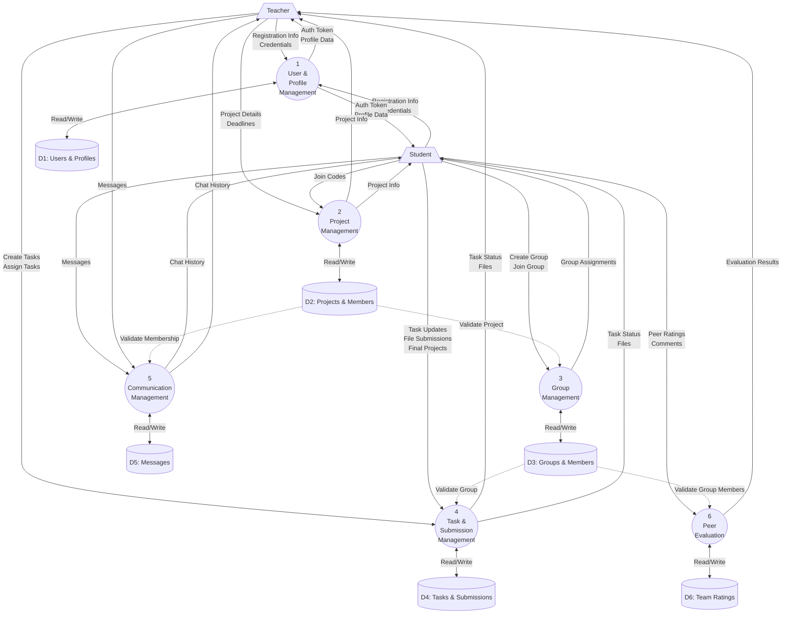

# Data Flow Diagrams (DFD)

Here are the Data Flow Diagrams representing the flow of information within the `ProjectHub` system.

## Level 0 Context Diagram
The context diagram shows the system as a single high-level process with its interactions with external entities (Users).

## Level 1 DFD
The Level 1 DFD breaks down the main system into major sub-processes and shows the data stores they interact with.

