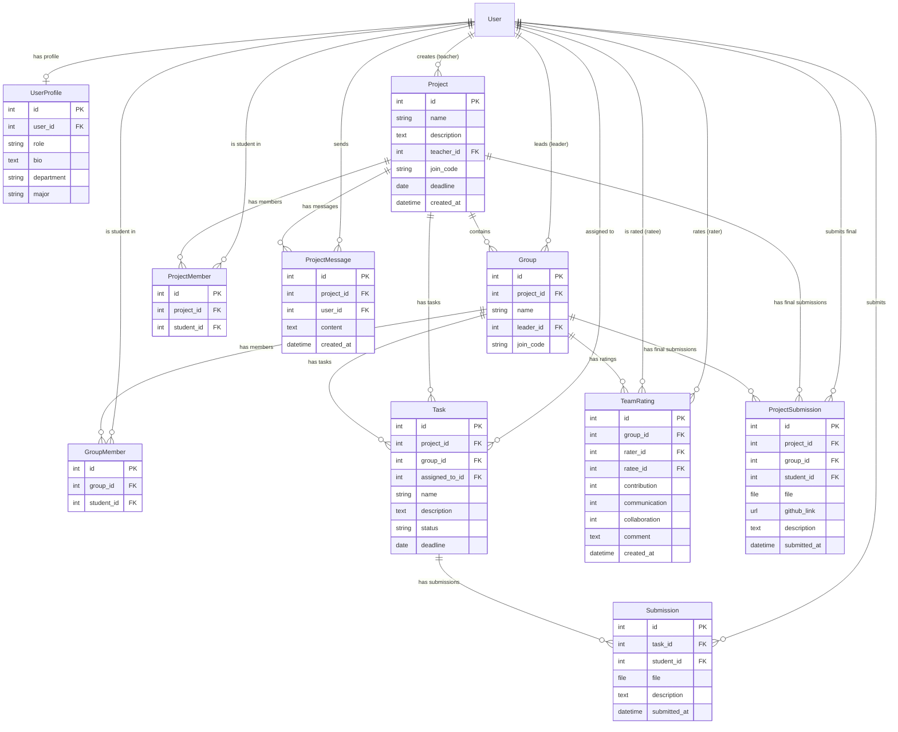

# Entity-Relationship Diagram

Here is the Entity-Relationship Diagram for the `ProjectHub-Backend` models located in `core/models.py`.

```mermaid
erDiagram
    User ||--o| UserProfile : "has profile"
    User ||--o{ Project : "creates (teacher)"
    User ||--o{ Group : "leads (leader)"
    User ||--o{ ProjectMember : "is student in"
    User ||--o{ GroupMember : "is student in"
    User ||--o{ Task : "assigned to"
    User ||--o{ Submission : "submits"
    User ||--o{ ProjectMessage : "sends"
    User ||--o{ TeamRating : "rates (rater)"
    User ||--o{ TeamRating : "is rated (ratee)"
    User ||--o{ ProjectSubmission : "submits final"

    Project ||--o{ Group : "contains"
    Project ||--o{ ProjectMember : "has members"
    Project ||--o{ Task : "has tasks"
    Project ||--o{ ProjectMessage : "has messages"
    Project ||--o{ ProjectSubmission : "has final submissions"

    Group ||--o{ GroupMember : "has members"
    Group ||--o{ Task : "has tasks"
    Group ||--o{ TeamRating : "has ratings"
    Group ||--o{ ProjectSubmission : "has final submissions"

    Task ||--o{ Submission : "has submissions"

    UserProfile {
        int id PK
        int user_id FK
        string role
        text bio
        string department
        string major
    }

    Project {
        int id PK
        string name
        text description
        int teacher_id FK
        string join_code
        date deadline
        datetime created_at
    }

    Group {
        int id PK
        int project_id FK
        string name
        int leader_id FK
        string join_code
    }

    ProjectMember {
        int id PK
        int project_id FK
        int student_id FK
    }

    GroupMember {
        int id PK
        int group_id FK
        int student_id FK
    }

    Task {
        int id PK
        int project_id FK
        int group_id FK
        int assigned_to_id FK
        string name
        text description
        string status
        date deadline
    }

    Submission {
        int id PK
        int task_id FK
        int student_id FK
        file file
        text description
        datetime submitted_at
    }

    ProjectMessage {
        int id PK
        int project_id FK
        int user_id FK
        text content
        datetime created_at
    }

    TeamRating {
        int id PK
        int group_id FK
        int rater_id FK
        int ratee_id FK
        int contribution
        int communication
        int collaboration
        text comment
        datetime created_at
    }

    ProjectSubmission {
        int id PK
        int project_id FK
        int group_id FK
        int student_id FK
        file file
        url github_link
        text description
        datetime submitted_at
    }
```
